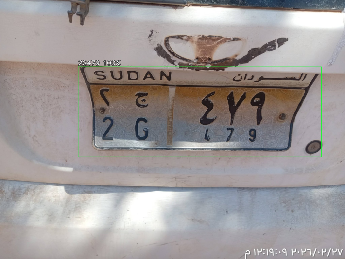
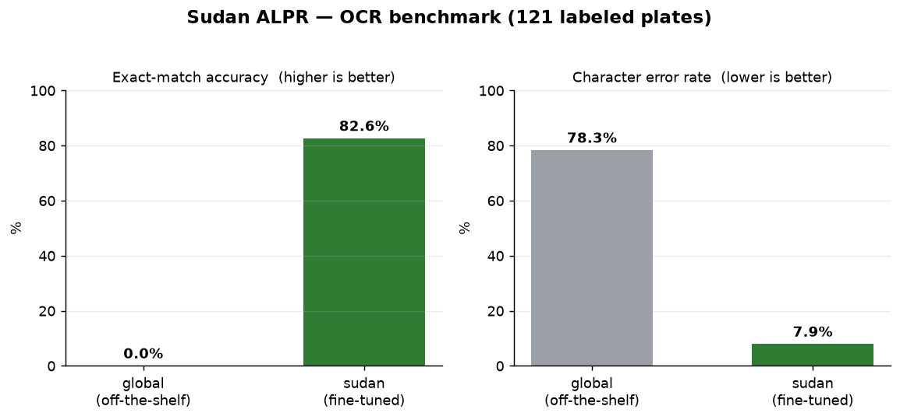

# Sudan ALPR

Reads Sudanese car license plates from real photos. It finds the plate, reads
the serial, confirms the plate is actually Sudanese, and tells you which state
(wilaya) it's from.

<p align="center">
  
  <br>
  <em>A real plate, detected and read: <code>2G479</code> → Sudan / Gezira</em>
</p>

It's built on [FastALPR](https://github.com/ankandrew/fast-alpr) and runs two
deep-learning models locally — no cloud, no API keys. I wrote it because the old
template-matching version I had (`license-plate-recognition-sudan/`) fell apart
the moment a photo was taken at an angle or from a distance, which is basically
every real photo.

This one holds up on messy, real-world shots.

## How it works

It's a two-stage pipeline, same idea every serious ANPR system uses:

```
car photo
   │
   ▼
[1] detect   →  a YOLO-v9 model locates the plate and crops it out
   │
   ▼
[2] read     →  a CCT transformer OCR model turns the crop into text → 3KH3476
   │
   ▼
[3] interpret →  confirm it's Sudanese + decode the state → Sudan / Khartoum
```

Both models run on your machine through ONNX Runtime. On Apple Silicon they use
CoreML automatically, so it's quick. The OCR model is fine-tuned on real
Sudanese plates, so it reads the Latin serial line (e.g. `3KH 3476`) even when
the lighting is bad or the plate is tilted.

## Requirements

- **Python 3.11 or 3.12.** Not 3.14 — onnxruntime doesn't ship a wheel for it
  yet, and you'll just hit an install error.
- Internet on the first run only, to pull the model weights (~11 MB). After
  that it works offline.

## Install

A ready-to-go `venv/` is included. If you'd rather build it yourself:

```bash
cd sudan-alpr-ai
python3.11 -m venv venv
./venv/bin/pip install -r requirements.txt
```

## Project layout

```
sudan-alpr-ai/
├── recognize.py            reader: global OCR + manual column splitting
├── recognize_trained.py    reader: the fine-tuned model (most accurate)
├── sudan_plate.py          interpreter: is-it-Sudanese? + state recognition
├── benchmark.py            measures accuracy and compares the models
├── make_chart.py           renders the benchmark chart in docs/
├── requirements.txt
├── models/
│   ├── sudan_ocr.onnx      OCR model fine-tuned on Sudanese plates
│   └── sudan_plate.yaml    model config (alphabet, input size, …)
├── input/                  drop your car photos here
├── output/                 annotated images + results.json + benchmark.json
└── training/               pipeline for fine-tuning the OCR on real plates
    ├── dataset/
    │   ├── good_plates/    cropped plates (used by training and benchmarks)
    │   ├── labels.csv      hand-verified ground truth
    │   ├── train.csv       training split
    │   └── val.csv         held-out validation split
    └── scripts/            crop → label → build dataset → train
```

The data flows in a loop: photos in `input/` get cropped by the detector into
`training/dataset/`, you label them in `labels.csv`, training produces
`models/sudan_ocr.onnx`, and `benchmark.py` scores that model back against
`labels.csv`. Collect more photos, run it again, get a better model.

Training details live in [`training/README.md`](training/README.md).

## Running it

There are two readers. Use `recognize_trained.py` unless you have a reason not
to — it's the accurate one.

| Script | OCR | When to reach for it |
|---|---|---|
| `recognize.py` | global model + **manual column split** | no trained model needed; leans on the known plate layout |
| `recognize_trained.py` | **fine-tuned** `models/sudan_ocr.onnx` | most accurate; reads the Latin line directly |

```bash
# the fine-tuned reader (recommended)
./venv/bin/python recognize_trained.py input/
./venv/bin/python recognize_trained.py input/some_car.jpg

# the column-split reader
./venv/bin/python recognize.py input/test_plate.png   # one image
./venv/bin/python recognize.py input/                 # a whole folder
./venv/bin/python recognize.py input/ --det-conf 0.5  # drop weak detections
```

Drop your photos in `input/`, point the script at it, done.

## Output

In the terminal you get the plate text plus country, class/state, and
confidence. Private plates show their state; special plates show their class:

```
📷 my_car.jpg
    🔖 3KH3476      🇸🇩 Sudan / Khartoum         (country 95% | detect 90%)
    🔖 POLICE00000  🇸🇩 Sudan / Police           (country 97% | detect 88%)
```

And in `output/`:

- `annotated_<image>` — the original photo with a box drawn around the plate
  and the reading (plus `KH/Sudan` or the class) written above it.
- `results.json` — everything in JSON: text, country, plate class, state,
  confidence scores, and the plate's bounding box.

## Country, class, and state recognition

Once the text is read, it passes through the Sudanese plate interpreter in
[`sudan_plate.py`](sudan_plate.py), which answers three things:

- **Is this a Sudanese plate?** Yes/no, with a confidence score.
- **What class of plate is it?** Private, government, police, army, diplomatic,
  UN, NGO, transit, temporary… (see below).
- **Which state (wilaya)?** For private plates, it decodes the state letters
  into a name, in both English and Arabic.

### Plate classes

Sudan doesn't issue one plate format — the General Directorate of Traffic uses
a whole family, told apart by colour and a text marker. The interpreter knows
all of them:

| Class | Marker | Typical colour | Arabic |
|---|---|---|---|
| Private | `<digit><state><serial>` | silver / white | خصوصي |
| Government | `GOV` | yellow | حكومي |
| Police | `POLICE` | red / blue | الشرطة |
| Armed Forces | `ARMY` | red | القوات المسلحة |
| Diplomatic | `CD` | red | دبلوماسي |
| United Nations | `UN` | blue | الأمم المتحدة |
| NGO | `NGO` | yellow | منظمة طوعية |
| High Committee | `HC` | green | اللجنة العليا |
| Limousine / Taxi | `LIMO` / `TAXI` | yellow | ليموزين / أجرة |
| Transit | `TRANSIT` | silver | عبور |
| Temporary | `TEMP` | silver | مؤقتة |
| Red Crescent | `HILAL` | red | الهلال الأحمر |

The **text marker decides the class** — so it still works on a greyscale or
badly-lit photo. If the caller also measures the plate's **colour** (the
column-split reader does, via `dominant_plate_color`), that colour is used as
*corroboration* and nudges the confidence up, but it's never the sole signal.

So a `POLICE 00000` plate reads as Police, an `ARMY 00000` as Armed Forces, a
`GOV 00000` as Government — and a normal `7KH10346` stays Private with its state
decoded to Khartoum.

### Why structure, not guessing

A Sudanese civilian plate has a fixed, well-known layout:

```
registration digit ─┐   ┌─ state letters   ┌─ serial number
                    7      KH                10346    →  "7KH10346"
```

The off-the-shelf global model used to *guess* the country, and it guessed
wrong — Sudan isn't in its 65-country list, so it would return whatever random
country looked closest. So I don't ask a model. I check the pattern itself:
digit, then state letters, then digits. That shape is specifically Sudanese.
If the text matches, the plate is Sudanese, and the interpreter records *why* it
decided that — no hallucinated answers.

### State codes

It decodes the standard Sudanese state codes. The ones that actually show up in
the dataset:

| Code | State | Code | State |
|---|---|---|---|
| `KH` | Khartoum | `NS` | River Nile |
| `G` | Gezira | `WN` | White Nile |
| `NK` | North Kordofan | `WK` | West Kordofan |
| `ND` | Northern | `RS` | Red Sea |
| … | (and the rest) | | |

It's also forgiving of bad OCR. If the reader drops the registration digit
(`KH5404`) or doubles it (`10KH6009`), the interpreter still recognizes the
plate as Sudanese — just with lower confidence instead of throwing it out.

### How well does it do?

Run the country benchmark and see for yourself:

```bash
./venv/bin/python benchmark.py --country --models sudan
```

| Model | Flagged Sudanese | Accuracy | State correct | State accuracy |
|---|---|---|---|---|
| **sudan (fine-tuned)** | 121/121 | **100.0%** | 118/121 | **97.5%** |

Every single plate got correctly flagged as Sudanese, and 97.5% landed on the
right state. The three state misses weren't logic errors — they were truncated
labels (digits with no state letter, nothing to decode). The point is the
number is measured, not asserted.

## How I got the accuracy up

I tried two approaches. Both are benchmarked below.

### First approach: splitting the columns by hand (`recognize.py`)

The global model on its own *failed* on Sudanese plates. It tries to read the
whole plate in one shot, mixes up the big Arabic line with the small Latin one,
and produces garbage. The first fix exploited the known layout:

```
┌──────────────────────────┐
│   SUDAN       السودان     │  ← top third (ignored)
│  ٧ خ          ١٠٣٤٦       │  ← big Arabic line
│  7KH          10346       │  ← small Latin line ← we read this
└──────────────────────────┘
   letter column  number column
```

1. **Crop each column separately** and read it on its own — letters (`7KH`) on
   the left, digits (`10346`) on the right.
2. **Upscale each crop 4×** before reading, since the digits are tiny.
3. **Fix common confusions** in the number column (`O→0`, `L→1`, `S→5`…),
   because it's digits only.
4. **Fall back** to reading the whole plate if the split fails on a tiny or
   blurry image.

On the first five real plates I tested by hand, this took accuracy from
**0/5 to 4/5**:

| Plate | Read | |
|---|---|---|
| `1KH 5490` | `1KH5490` | ✅ |
| `1NS 180` | `1NS180` | ✅ |
| `2KH 14514` | `2KH14514` | ✅ |
| `7KH 10346` | `7KH10346` | ✅ |
| 76×39 px plate (way too far) | wrong | ❌ too small |

### Second approach: training a custom model (`recognize_trained.py`)

Instead of hand-written rules, I took the global model and fine-tuned it on
labeled real Sudanese plates. The result reads the Latin line directly, no
rules needed, and hits **~83% exact-match** versus **0%** for the global model
on the same images. Full numbers below; training steps are in
[`training/README.md`](training/README.md).

## Benchmark

"It works great" means nothing without a number behind it. So there's a
benchmark script that scores the models objectively, on the **same images**,
against **hand-labeled ground truth** (`training/dataset/labels.csv`).

### How the benchmark works

1. It takes the **pre-cropped** plates from `training/dataset/good_plates/`.
2. It runs each one through the OCR model **only** — the detector is out of the
   loop — so the numbers reflect *reading* accuracy, not detection, and the
   comparison is fair (identical inputs for every model).
3. It compares the model's text to the correct answer, character by character
   (after normalizing both to letters and digits).

### The metrics

| Metric | What it means | Better |
|---|---|---|
| **Exact-match** | the whole plate is read correctly, character for character | higher |
| **CER** (character error rate) | edit distance ÷ characters; catches "almost right" | lower |
| **ms/plate**, **plates/s** | speed | faster |

### What's being compared

- **global** — the stock `cct-xs-v2-global-model` (65+ countries). Never saw a
  Sudanese plate. This is the baseline.
- **sudan** — my fine-tuned `models/sudan_ocr.onnx`, trained on real Sudanese
  plates.

### Commands

```bash
# every labeled plate, both models
./venv/bin/python benchmark.py

# the held-out validation set only (the model never trained on these)
./venv/bin/python benchmark.py --split val

# one model, and print every misread
./venv/bin/python benchmark.py --models sudan --show-errors

# country (is-it-Sudanese?) + state recognition
./venv/bin/python benchmark.py --country --models sudan

# dump the results to JSON
./venv/bin/python benchmark.py --json output/benchmark.json
```

### The numbers

<p align="center">
  
</p>

Across **all 121 labeled plates:**

| Model | Exact-match | Accuracy | CER | ms/plate | plates/s |
|---|---|---|---|---|---|
| global (baseline) | 0/121 | **0.0%** | 78.3% | ~7.1 | ~140 |
| **sudan (fine-tuned)** | 100/121 | **82.6%** | **7.9%** | ~6.0 | ~167 |

The chart above is generated from the benchmark output — run
`./venv/bin/python make_chart.py` to regenerate it from
`output/benchmark.json`.

On the **held-out validation set (19 plates the model never saw):**

| Model | Exact-match | Accuracy | CER |
|---|---|---|---|
| **sudan (fine-tuned)** | 16/19 | **84.2%** | **4.5%** |

The global model scores a flat 0% because it reads the whole plate at once,
blends the Arabic and Latin lines, and spits out junk like `AAA` or `41SA1`.
The fine-tuned model jumps to ~83% on the exact same crops. That gap is the
whole argument for training it.

These numbers are reproducible — run the command and you'll get the same thing
(ms/plate will wobble a bit depending on your machine).

### Reading the results

- The plates that fail are usually **too small or blurry**, or lost a character
  when they were cropped (e.g. `1K91490` read as `1KH91490` — one extra
  character). There's nothing in the pixels to read. Use `--show-errors` to see
  exactly what failed and why.
- A **low CER with a lower exact-match** means the model is *close* — usually
  one character off, not lost. That's the healthy kind of wrong: more training
  data closes it.

## Honest caveats

1. **Failures are almost always image quality**, not the model. A 76×39 px
   plate (tiny and blurry) or a character clipped during cropping — no model
   can read detail that isn't in the photo. Closer, sharper shots fix it. Run
   `benchmark.py --show-errors` for the full list of what fails and why.
2. **The country is no longer guessed by the global model** (which used to
   return wrong countries because Sudan isn't in its 65-country list). It's now
   decided from the plate's structure in [`sudan_plate.py`](sudan_plate.py),
   at **100%** on this dataset — see the country/state section above.
3. **The Arabic line** (`٣خ ٣٤٧٦`): the OCR is tuned for Latin text, so we read
   the bottom Latin line, which carries the same information. If you specifically
   need the Arabic text read accurately, that means fine-tuning an OCR on real
   Sudanese plates — doable, but it needs a labeled dataset.
4. **To push accuracy even higher** on Sudanese plates specifically: gather
   200–500 plate photos, annotate them, and fine-tune both the detector and the
   OCR on them. The training pipeline here is set up for exactly that.

## Versus the old version

| | Old version (MATLAB / corr2) | This version (AI) |
|---|---|---|
| Method | pixel template matching | deep learning (YOLO + transformer OCR) |
| Angled real photos | usually failed | handles them fine |
| Setup | needs MATLAB | free Python |
| Accuracy | limited | high |
